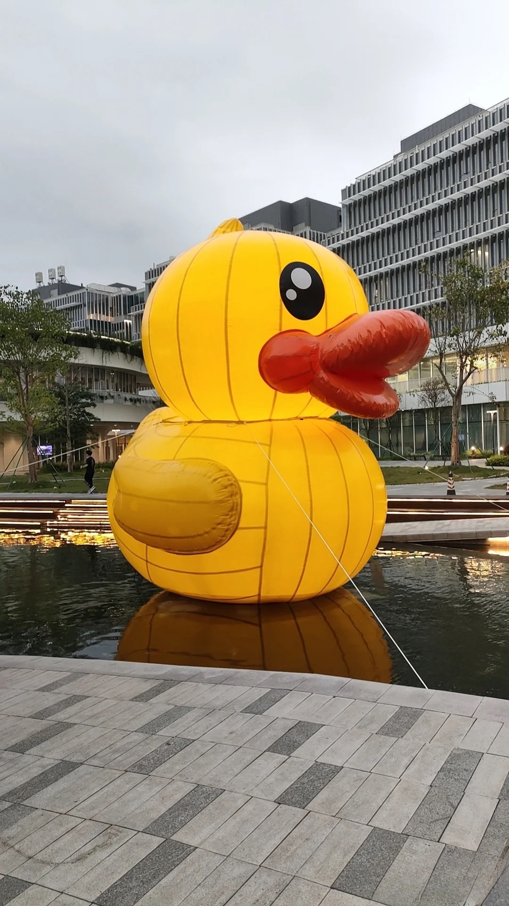

<div style="background-color: #f0f0f0; padding: 10px; border-radius: 10px;">

<div style="background-color: #f0f0f0; padding: 10px; border-radius: 10px; font-family: Arial, sans-serif;">
    <h2 style="text-align: center; margin-bottom: 20px;">🚀 Project Overview (TL;DR)</h2>
    
    <p style="color: #555; text-align: justify;">
        This project delves into cutting-edge neural rendering techniques, with a focus on Neural Radiance Fields (NeRF) and Gaussian Splattings for in-the-wild reconstruction.
    </p>
    
    <h3 style="margin-top: 20px;">Your Task: 🎯</h3>
    <ol style="color: #555;">
        <li><strong>Train:</strong> ️‍Reconstruct the provided in-the-wild dataset with advanced neural reconstruction techniques.</li>
        <li><strong>Enhance:</strong> Improve upon the baseline method to achieve more realistic novel view synthesis.</li>
    </ol>
    
    <h3 style="margin-top: 20px;">Key Challenges: </h3>
    <ul style="color: #555;">
        <li>Handling dynamic appearance changes</li>
        <li>Mitigating overfitting issues</li>
        <li>Optimizing for unseen test images</li>
    </ul>
    
    <p style="color: #3d85c6; font-style: italic; text-align: center; margin-top: 20px;">
        💡 Explore the World in its Digital Twin.
    </p>
</div>

</div>

**Neural rendering** is an innovative approach that combines computer vision, deep learning, and computer graphics to generate new views of 3D scenes. It uses neural networks to learn a representation of a scene from input images, which can then be used to synthesize photorealistic views from unseen angles. This concept is extended to **in-the-wild reconstruction**, which applies these techniques to uncontrolled, real-world image data from diverse sources.

One revolutionary technique in this field is **Neural Radiance Fields (NeRF)**. NeRF represents a 3D scene as a continuous function that maps 3D coordinates and viewing directions to color and density. By optimizing this neural representation to reconstruct input views, NeRF can render novel viewpoints with remarkable detail and consistency, effectively solving the challenge of synthesizing new perspectives of complex scenes.

In this project, you are required to train a neural radiance field (or other novel view synthesis algorithms, including Gaussian Splatting) on the provided in-the-wild `duck` dataset.

The dataset features an outdoor scene captured at different times on the HKUST(GZ) campus, with a duck floating on water. Your algorithms should be capable of modeling **appearance changes**. Below are two example images from the training set:

<figure>
    <p align='center'>
        
        
    </p>
    <figcaption align='center'>Two example training images from the dataset, showing different weather conditions and times of day.</figcaption>
</figure>

For evaluation, you're asked to synthesize 2 novel views of the given scene. Half of each image and the corresponding camera parameters are provided. Below is an example test image:

<figure>
    <p align='center'>
        
    </p>
    <figcaption align='center'>An example test image from the dataset. The lower half is masked out for evaluation purposes.</figcaption>
</figure>

The dataset contains:

- Several training images and 2 masked test images, collected from the Internet
- Camera parameters for all images (including test set cameras)
- A sparse point cloud extracted with [hloc](https://github.com/cvg/Hierarchical-Localization)

The dataset structure in the workspace is as follows:
``` bash
.
└── duck_dataset
    ├── images
    ├── transforms.json
    ├── sparse_pc.ply
    └── test_images
```

The dataset is formulated in a standard [nerfstudio](https://nerf.studio) dataset, thus we recommend using the nerfstudio toolbox to develop your algorithms.

# Tutorial Session
In the first tutorial session, we will give a brief introduction to the awesome neural radiance field technique. You will also learn about the idea of **"In-the-wild Reconstruction"** -- how you can leverage images from the Internet to recover the appearance and geometry of a 3D scene.

For the **homework** (not graded, but is necessary to finish the final proejct), you will be training a [NeRFacto](https://docs.nerf.studio/nerfology/methods/nerfacto.html) model on the given dataset.

<figure>
    <p align='center'>
        
    </p>
    <figcaption align='center'>Method Pipeline of the NeRFacto Algorithm. Please pay attention to the "Appearance Embedding" module since it handles the apperance changes in in-the-wild images.</figcaption>
</figure>

Following steps are recommended for this task:

1. Find a NVIDIA GPU server with at least 12GB GPU memory;
2. Create a new [conda](https://docs.anaconda.com/miniconda/) environment with PyTorch and necessary CUDA toolbox installed;
3. Install [nerfstudio](https://nerf.studio) and [tiny-cuda-nn](https://github.com/NVlabs/tiny-cuda-nn) following the official [documentations](https://docs.nerf.studio/quickstart/installation.html);
4. Train a nerfacto model on the given dataset:
```bash
# cd /path/to/your/workspace
ns-train nerfacto --data duck_dataset
```

If everything goes well, you should see something similar to this in your console:
<figure>
    <p align='center'>
        
    </p>
    <figcaption align='center'>Screenshot of the raining process.</figcaption>
</figure>

If you open up the link, you should see your model rendering something like this:
<figure>
    <p align='center'>
        
    </p>
    <figcaption align='center'>Screenshot of the nerfstudio viewer.</figcaption>
</figure>

You are recommended to play with the viewer because it gives you a sense of how the whole system works and how well your model is. You may go ahead evaluate your model and submit it to our Leaderboard (please see the instruction in the bottom) to examine the metrics on the test set.


## Evaluation Metrics

We use three common metrics to evaluate the quality of the rendered images compared to the ground truth:

1. **PSNR (Peak Signal-to-Noise Ratio)**: Measures the ratio between the maximum possible signal power and the power of distorting noise. Higher values indicate better quality.

2. **SSIM (Structural Similarity Index)**: Compares local patterns of pixel intensities across luminance, contrast, and structure. Values range from 0 to 1, with 1 indicating perfect structural similarity.

3. **LPIPS (Learned Perceptual Image Patch Similarity)**: A perceptual metric that uses deep networks to measure image similarity more closely aligned with human perception. Lower values indicate higher perceptual similarity, typically ranging from 0 to 1.

# Final Project
The images produced in the tutorial session may lack realism due to several factors:

1. NeRFacto uses an averaged appearance embedding for all test images, whereas each image should ideally have a unique embedding to capture specific lighting and environmental conditions.

2. The sparsity of training views can lead to overfitting, causing the model to struggle with novel viewpoints or lighting conditions not encountered during training.

3. There is potential for improvement in the NeRFacto model itself, possibly through architectural modifications or enhanced training techniques.

4. Other factors may also contribute to the lack of realism.

**For your final project, your task is to enhance the baseline method presented in the tutorial session. You have the freedom to employ any technique or utilize any available data as you want.**

Though there are no restrictions on what you should do, here're some general advices that you may want to consider:

1. **Optimize the appearance embedding for each test image:** One possible method is to **fix** the trained NeRF model and only optimize the appearance embedding for individual test images. You can use the provided half of each test image to formulate an optimization task.

2. **Address overfitting through data augmentation or prior knowledge:** Incorporate monocular depth or normal information, or leverage diffusion models to iteratively refine rendering results. Some relevant references include:
    - [1] Deng, K., Liu, A., Zhu, J.-Y., & Ramanan, D. (2022). [*Depth-supervised NeRF: Fewer Views and Faster Training for Free.*](https://www.cs.cmu.edu/~dsnerf/) In Proceedings of the IEEE/CVF Conference on Computer Vision and Pattern Recognition (CVPR) (pp. 12872-12881).
        - *Regularize the geometry by incorporating depth or normal information. (for NeRFs).*
    - [2] Turkulainen, M., Ren, X., Melekhov, I., Seiskari, O., Rahtu, E., & Kannala, J. (2024). [*DN-Splatter: Depth and Normal Priors for Gaussian Splatting and Meshing.*](https://maturk.github.io/dn-splatter/) arXiv preprint arXiv:2403.17822.
        - *Regularize the geometry by incorporating depth or normal information (for Gaussian Splatting).*
    - [3] Poole, B., Jain, A., Barron, J. T., & Mildenhall, B. (2022). [*DreamFusion: Text-to-3D using 2D Diffusion.*](https://dreamfusion3d.github.io/) arXiv preprint arXiv:2209.14988.
        - *How generative AI can be utilized to enhance your rendering results*.
3. **Explore recent state-of-the-art methods in NeRF or Gaussian Splatting:** Be cautious, as some techniques may not directly transfer to in-the-wild reconstruction settings. Some informative references include:
    - [4] Barron, J. T., Mildenhall, B., Verbin, D., Srinivasan, P. P., & Hedman, P. (2023). [*Zip-NeRF: Anti-Aliased Grid-Based Neural Radiance Fields.*](https://jonbarron.info/zipnerf/) In Proceedings of the IEEE/CVF International Conference on Computer Vision (pp. 19697-19705).
        - *The current state-of-the-art NeRF algorithm.*
    - [5] Kerbl, B., Kopanas, G., Leimkühler, T., & Drettakis, G. (2023). [*3D Gaussian Splatting for Real-Time Radiance Field Rendering.*](https://repo-sam.inria.fr/fungraph/3d-gaussian-splatting/) ACM Transactions on Graphics.
        - *Original paper of 3D Gaussian Splatting.*
    - [6] Zhang, D., Wang, C., Wang, W., Li, P., Qin, M., & Wang, H. (2024). [*Gaussian in the Wild: 3D Gaussian Splatting for Unconstrained Image Collections.*](https://eastbeanzhang.github.io/GS-W/) arXiv preprint arXiv:2403.15704.
        - *Adapt Gaussian Splatting to our in-the-wild setting.*
    - [7] Y. Wang, C. Wang, B. Gong, and T. Xue, [*Bilateral Guided Radiance Field Processing.*](https://arxiv.org/abs/2406.00448) arXiv:2406.00448, 2024.
        - *A recent paper that use bilateral filters for in-the-wild reconstruction, originally done with NeRF, but could also utilized in Gaussian Splattings.*


We encourage you to discuss your ideas with the TA to ensure you're on the right track.

### Evaluation

For the final evaluation, you are required to submit:

- a report (please follow the course requirements);
- the code implementation;
- and the evaluation results from the leaderboard (you need to include the final submission ID in your report).

Some bonus points will gives to the groups with higher rank in the leaderboard.

# Submit to the Leaderboard

Please run the following command to produce submission file `submit.zip`. After generation of the zip file, please submit to the project website.
```bash
python eval.py --load-config outputs/.../config.yml
```

After a suceessfull submission, you should see a panel of submission summary:
<figure>
    <p align='center'>
        
    </p>
    <figcaption align='center'>Submission summary.</figcaption>
</figure>


Should you encounter any issue or need a discussion, please contact the TA at <a href="mailto:zirui.wu@hkust-gz.edu.cn">zirui.wu@hkust-gz.edu.cn</a> or WeChat (15321590356).
